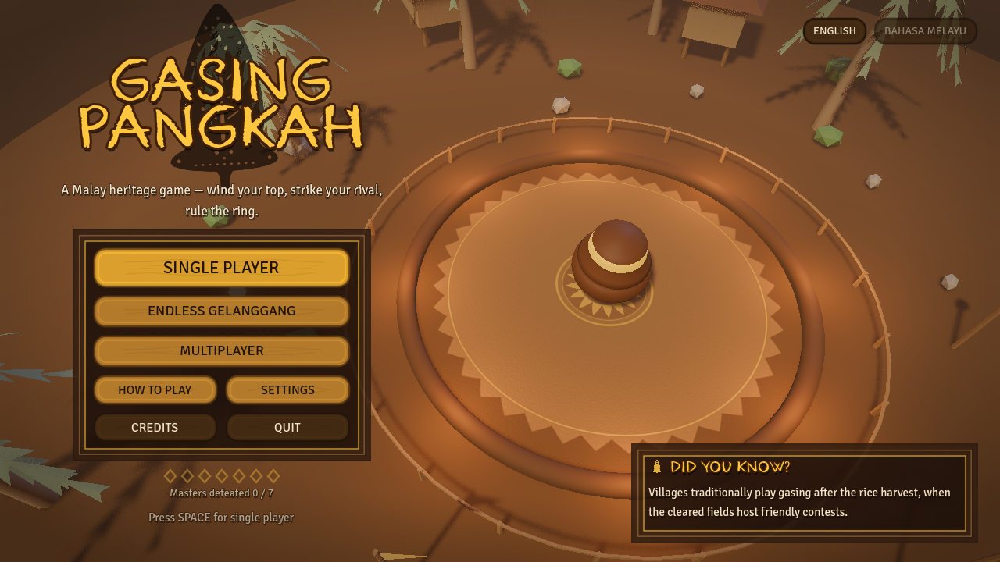
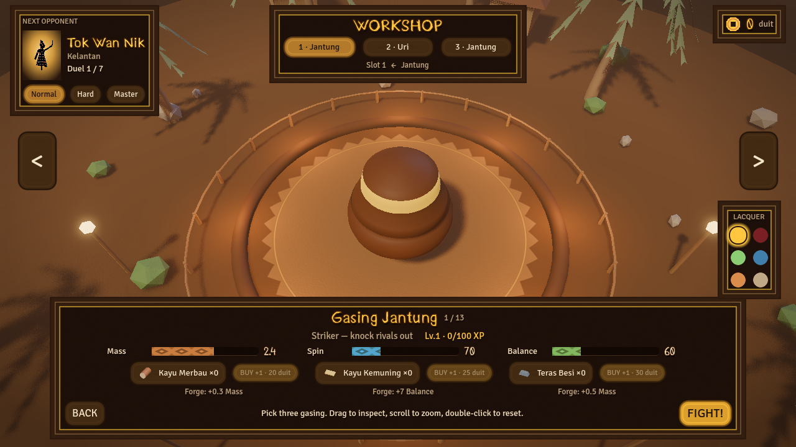
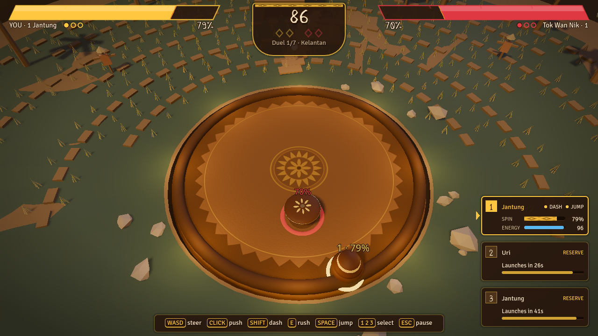
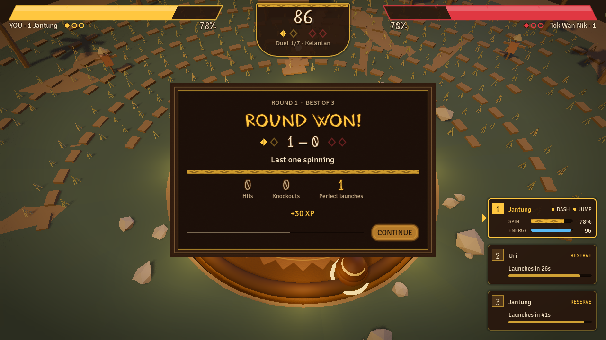
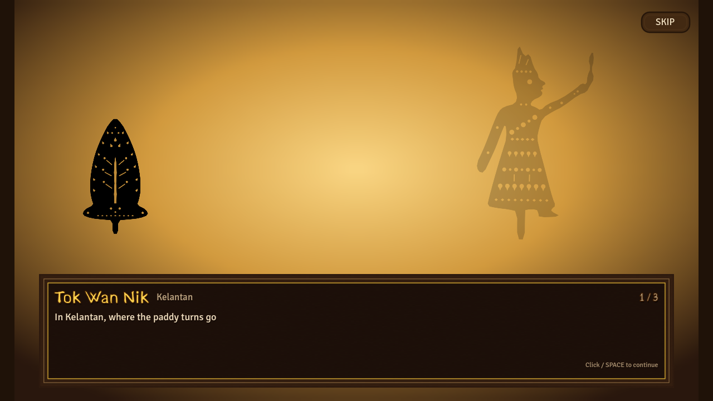
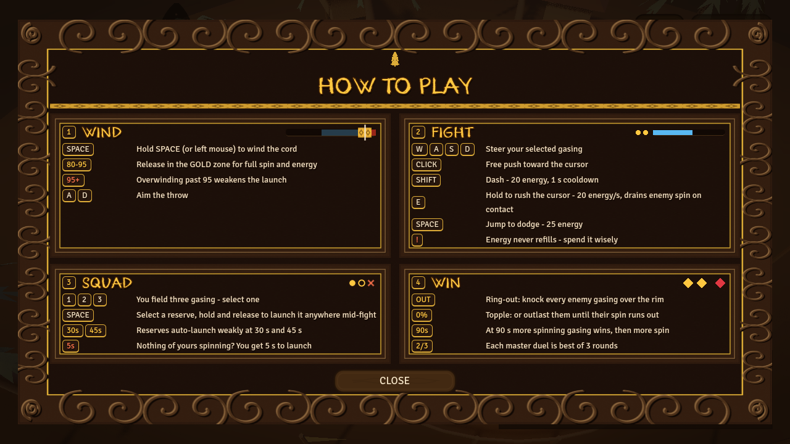

# Gasing Pangkah

Godot 4.7 arena battler with a Malaysian gasing workshop, campaign, endless mode and 2–4 player LAN/Steam FFA. Open `project.godot` in the GodotSteam-enabled Godot build used by this project and run `main.tscn`.

| Title | Workshop | Battle | Round result |
| --- | --- | --- | --- |
|  |  |  |  |

| Wayang cutscene | How to play |
| --- | --- |
|  |  |

## Modes

- **Story campaign:** seven masters across Malaysia, each introduced by a wayang kulit cutscene and fought in their own arena: Kelantan, Penang, Melaka, Terengganu, Sarawak, Sabah and Kuala Lumpur. A lost duel ends the run. Progress is saved, and the title offers CONTINUE.
- **Endless Gelanggang:** a one-round-per-wave gauntlet against the masters in turn. Your best wave is recorded.
- **Multiplayer:** 2–4 player FFA over LAN or Steam (see below).

Settings (volume for master, music and SFX; fullscreen; low graphics; English or Bahasa Melayu) are saved in `user://settings.cfg`. HOW TO PLAY on the title screen explains the controls.

## Play

Choose three owned gasing in the workshop; repeated styles are allowed. Drag the preview to inspect, scroll to zoom and double-click to reset. Choose Normal (default), Hard or Master for solo play. Each campaign duel against a master is best of 3 rounds; an endless wave is a single round.

| Input | Action |
| --- | --- |
| WASD / arrows | Steer the selected gasing |
| Left click | Free directional push |
| 1 / 2 / 3 or squad card | Select a live gasing or reserve slot |
| Shift | Dash: 20 energy, 1-second cooldown |
| Hold E | Rush toward the mouse: 20 energy/second; enemy contact drains spin |
| Space | Jump: 25 energy, 2.5-second cooldown |
| Hold/release Space with a reserve selected | Charge and launch that reserve |
| A / D while charging | Aim the launch |
| Esc | Cancel a live charge; otherwise pause. Back in menus, skip in cutscenes |
| F11 | Toggle fullscreen (also in Settings) |
| Enter (workshop) | FIGHT |

Opening charge also accepts the left mouse button. Release in the gold zone for more spin and energy; going past 95 breaks the cord. Energy never refills. Unselected gasing keep their momentum and spin without automatic attacks.

Reserve slots auto-launch with weak charge at 30 and 45 seconds. If no gasing remains spinning, you have five seconds to launch a reserve before an automatic launch. The arena keeps running while you charge. The last surviving owner wins; at 90 seconds, living gasing count wins, then combined remaining spin percentage. This is a round limit; attacks and ringouts can end a round earlier. Exact ties draw. Multiplayer plays to three round wins.

## Workshop progression

Each unique deployed, owned style gains 30 XP for a round win or 15 for a loss/draw. Levels 1–5 use cumulative XP thresholds 0, 100, 250, 450 and 700. Each level above one adds 4 spin reserve, 1 balance and 0.04 mass in solo play, plus a metallic band and polished finish. Multiplayer uses each style's base stats with cosmetic levels.

`user://workshop.cfg` automatically migrates older saves, preserving materials, money, unlocks, forging, colors and endless records. Test mode and netbots never read or write the real workshop save.

## Multiplayer

- LAN: HOST (LAN), then other players enter the host's IP and press JOIN BY IP (default port 8080). Use `127.0.0.1` for multiple local instances.
- Steam: start Steam, then HOST (STEAM) and share the lobby code (friends use JOIN CODE) or invite friends. Steam must be initialized with authenticated accounts; LAN works when Steam is unavailable.
- The host starts with 2–4 players. No joining after Start. A departing client forfeits its squad; remaining players continue. Host departure ends the session. Rematch requires every remaining player.

The host simulates all gasing. Commands validate sender ownership, selected slot, round, energy and cooldown. Compact snapshots run at 20 Hz; launch, elimination and results use reliable messages.

## Credits

- Music and most SFX: synthesized for this project by `tools/gen_audio.py` (numpy, scipy, soundfile), in gamelan, gendang and kompang styles.
- Crowd cheer: includes a CC0 excerpt of "Applause in a large hall or church" by eXpl0it3r (OpenGameArt).
- Impact and interface sounds: Kenney.nl (CC0).
- Fonts: Kurland by GGBotNet and Signika by The Signika Project Authors, both SIL OFL 1.1 (licences are in `common/fonts/`).
- Engine: Godot Engine (MIT) and GodotSteam (MIT).

Full per-file sources are listed in `assets/audio/CREDITS.txt`.

## Checks

Using your Godot executable:

```text
Godot --headless --path . --script scripts/feature_checks.gd -- --test-mode
Godot --headless --path . -- --test-mode netbot-host netbot-count=4
Godot --headless --path . -- --test-mode netbot-join netbot-count=4
```

Run one host and the required number of clients for netbot tests. Set `GODOT_MCP_HEADLESS_CHILD=1` for those child processes so their MCP file queues do not interfere with the editor's interactive game. `netbot-forfeit` makes a client leave after eight simulated seconds. Give each process a separate `--log-file` when collecting evidence.

The retained checks cover action costs and timing, charge, collisions, reserve deadlines, result ties, XP, save migration and multiplayer input validation. Test Steam separately with different accounts; LAN success does not verify Steam connectivity.
